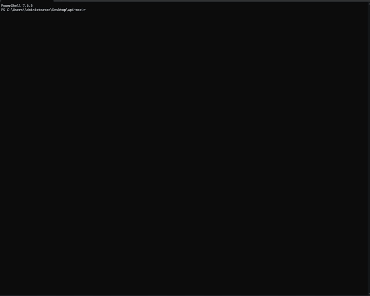

# opencode-skills-tui

<p align="center">
  English | <a href="README.zh-CN.md">简体中文</a>
</p>
<p align="center">
  <a href="https://www.npmjs.com/package/opencode-skills-tui"></a>
  <a href="https://www.npmjs.com/package/opencode-skills-tui"></a>
  <a href="LICENSE"></a>
</p>

An [OpenCode](https://opencode.ai) TUI plugin that adds a `Skills` section to the right sidebar listing every skill OpenCode can see. Skills loaded in the current session are marked green and moved to the top, any skill's full SKILL.md is one right-click away, and a toggle can narrow the list down to loaded skills only.



## ✨ Features

- 📋 `Skills` section in the session sidebar — every skill OpenCode knows about, sorted by name
- 🟢 Loaded skills marked green and moved to the top, tracked separately for each session
- 👁️ Right-click any skill to read its full SKILL.md in a window — scroll with the mouse wheel, close with `esc` or a click outside
- 🎚️ `/skills-toggle` narrows the sidebar down to loaded skills only
- 📁 Collapsible panel header with a live summary — `(X loaded Y available)`
- 🔄 List keeps itself up to date as sessions and messages change
- 🔔 Notifies you when a newer version is published, with the exact cache directory to delete — OpenCode won't pick up a new release on its own
- 💾 Your panel preferences survive restarts

## 📦 Installation

This is a **TUI plugin**, so it must be configured in `~/.config/opencode/tui.json`, not in `opencode.json`.

### Option 1: let your agent do it (recommended)

Paste this into OpenCode, or any LLM agent:

```text
Install the opencode-skills-tui plugin by following the instructions here:
https://raw.githubusercontent.com/aihaipeng/opencode-skills-tui/main/README.md
```

### Option 2: from npm

Add the package name to `~/.config/opencode/tui.json`:

```json
{
  "$schema": "https://opencode.ai/tui.json",
  "plugin": [
    "opencode-skills-tui"
  ]
}
```

OpenCode installs npm plugins automatically at startup, **using [Bun](https://bun.sh)** — so Bun must be on your `PATH`. Without it the install fails silently and the TUI can hang on the loading screen (see Troubleshooting below). Check with `bun --version`; if it's missing, install it first: `curl -fsSL https://bun.sh/install | bash` (macOS/Linux).

### Option 3: build from source

```bash
git clone https://github.com/aihaipeng/opencode-skills-tui.git
cd opencode-skills-tui
bun install
bun run build
```

That produces `dist/tui.js`. Register its absolute path in `~/.config/opencode/tui.json`:

```json
{
  "$schema": "https://opencode.ai/tui.json",
  "plugin": [
    "C:\\path\\to\\opencode-skills-tui\\dist\\tui.js"
  ]
}
```

Keep any existing entries in the `plugin` array — it can hold multiple plugins.

### ⬆️ Updating

- **npm install**: just restart `opencode` — plugins are re-resolved at startup. If the old version is still loaded, delete `~/.cache/opencode/packages/opencode-skills-tui@latest/` and restart again.
- **Local install**: `git pull`, then `bun install && bun run build`, then restart `opencode`.

### 🔄 Restart OpenCode

TUI plugins are loaded at startup; there is no hot reload. Restart `opencode` after installing or updating.

### 🤖 For LLM Agents

<details>
<summary>Step-by-step instructions when an AI agent is doing the install</summary>

1. Check Bun: `bun --version`. If it's missing, install it from <https://bun.sh> first — the npm auto-install fails silently without it and the TUI hangs on the loading screen.
2. Read `~/.config/opencode/tui.json` (create it if missing). This is a **TUI plugin**: it goes into `tui.json`, never into `opencode.json`.
3. Add `"opencode-skills-tui"` to the `plugin` array, keeping existing entries:

   ```json
   {
     "$schema": "https://opencode.ai/tui.json",
     "plugin": ["opencode-skills-tui"]
   }
   ```

4. Don't run `npm install` / `bun add` manually — OpenCode fetches npm plugins itself at startup.
5. Tell the user to restart `opencode` (no hot reload). A `Skills` section in the right sidebar means it worked.

</details>

## 🚀 Usage

| Action | Result |
| --- | --- |
| Click the `Skills` header | Collapse / expand the panel |
| Right-click a skill | Preview its SKILL.md content in a window — scroll with the wheel, close with `esc` or a click outside |
| `/skills-toggle` | Toggle the sidebar between all skills and loaded-only |

## 🧠 How "loaded" is determined

A skill counts as loaded for a session when any of these appears in its messages:

1. The `skill` tool is invoked with that skill's name
2. A `<skill_content name="...">` injection tag for it
3. A slash command (`/some-skill`) pastes its body into the session

After a restart the green marks come back on their own — the plugin re-reads each session's history the first time you open it.

## 🛠️ Troubleshooting

- **TUI stuck on the loading screen after adding the npm plugin**: the automatic install requires Bun on your `PATH` and fails silently when it is missing. Check with `bun --version`; install Bun or fall back to Option 3 (build from source), then restart `opencode`.
- **No `Skills` section**: check the path in `tui.json` is absolute and correct, then restart. `opencode --pure` skips all external plugins — handy to confirm the plugin is the cause.
- **Loaded skills not green after a restart**: the plugin re-fetches session history once per session; switch to the session and give it a moment.
- **Updated the plugin but nothing changed**: restart `opencode`.

## 🧑‍💻 Development

```bash
bun install
bun run build      # bundle to dist/tui.js + declarations
bun run typecheck  # tsc --noEmit
```

### 📂 Project structure

```text
src/
├── tui.tsx                       # Plugin entry: sidebar panel, skill preview, commands, update check
├── skill-data.ts                 # Skill discovery and loaded-state detection
└── components/
    └── skills-panel.tsx          # Sidebar panel rendering
```

If you find this useful, consider giving it a ⭐ — it helps others discover this plugin.

## 📄 License

[MIT](LICENSE)
